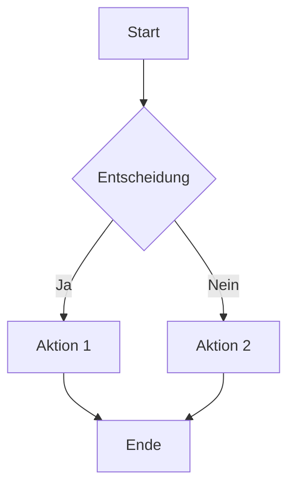
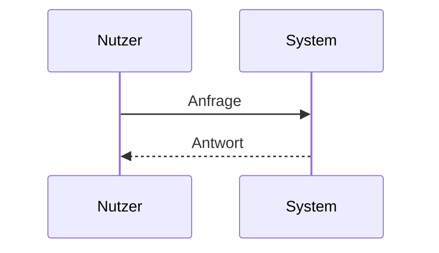

# Markdown Komplettübersicht

Dieses Dokument zeigt (fast) alles, was Markdown kann – inklusive Erweiterungen wie **LaTeX-Mathematik**, **Mermaid-Diagramme**, Tabellen und Fußnoten.

---

## 1. Überschriften

# H1

## H2

### H3

#### H4

##### H5

###### H6

---

## 2. Textformatierung

**Fett**
*Kursiv*
***Fett + Kursiv***
~~Durchgestrichen~~
`Inline-Code`

> Blockzitat
>
> > Verschachteltes Zitat

---

## 3. Listen

### Ungeordnet

* Punkt 1
* Punkt 2

  * Unterpunkt

### Geordnet

1. Eins
2. Zwei

   1. Untereins
   2. Unterzwei

### Task-Liste

* [x] Erledigt
* [ ] Offen

---

## 4. Links & Bilder

[OpenAI](https://www.openai.com)

)

---

## 5. Codeblöcke

```python
def hello():
    print("Hallo Welt")
```

```javascript
console.log("Hello World");
```

---

## 6. Tabellen

| Name | Alter | Beruf        |
| ---- | ----- | ------------ |
| Anna | 28    | Entwicklerin |
| Max  | 34    | Designer     |

---

## 7. Horizontale Linie

---

---

---

---

## 8. Fußnoten

Hier ist eine Aussage mit Fußnote[^1].

[^1]: Das ist die Fußnote.

---

## 9. Mathematik (LaTeX)

Inline: $E = mc^2$

Block:

$$
\int_0^\infty e^{-x} dx = 1
$$

Weitere Beispiele:

$$
a^2 + b^2 = c^2
$$

$$
f(x) = x^2 + 3x + 5
$$

---

## 10. Mermaid Diagramme



### Sequenzdiagramm



---

## 11. HTML in Markdown

<div style="color: red;">Dieser Text ist rot (HTML)</div>

---

## 12. Escape-Zeichen

\*kein kursiv\*

---

## 13. Definitionen

Begriff
: Definition des Begriffs

---

## 14. Emojis 😄

:smile: :rocket: :fire:

---

## 15. Checkliste komplex

* [x] Markdown
* [x] Tabellen
* [x] Mathe
* [x] Mermaid
* [ ] Perfektion 😄

---

## Ende

Das war eine umfassende Markdown-Demo-Datei 🚀
