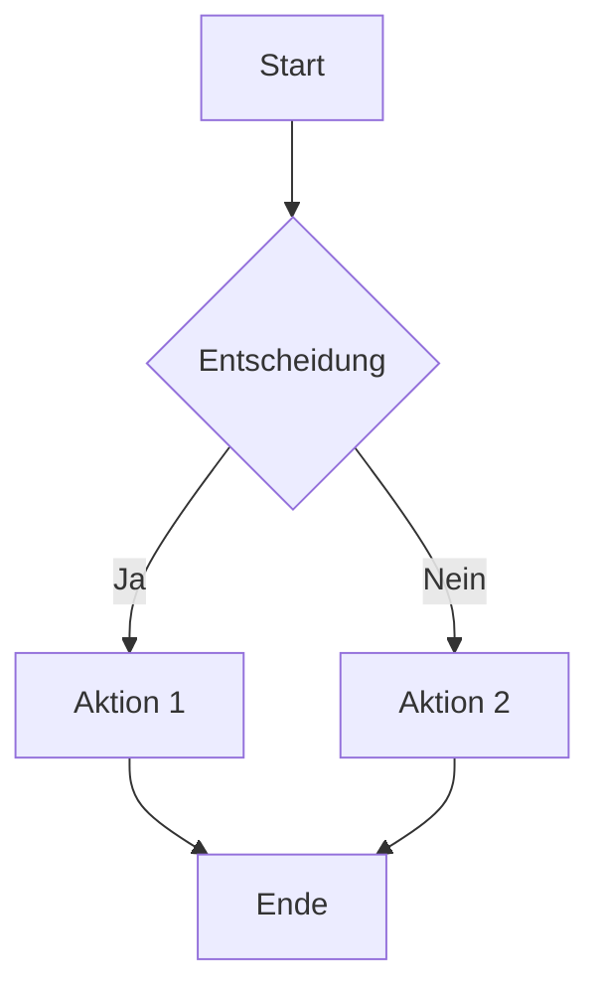
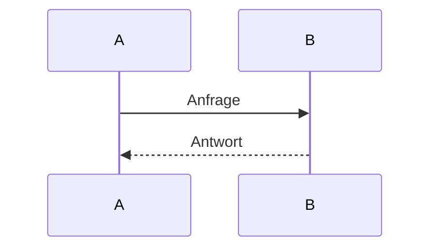

# Vollständige Markdown-Demonstration

Dieses Dokument zeigt **möglichst viele Markdown-Funktionen** in einer Datei.

---

## Inhaltsverzeichnis

- [Vollständige Markdown-Demonstration](#vollständige-markdown-demonstration)
  - [Inhaltsverzeichnis](#inhaltsverzeichnis)
  - [Textformatierung](#textformatierung)
  - [Fußnoten](#fußnoten)
  - [Listen](#listen)
    - [Unsortiert](#unsortiert)
    - [Sortiert](#sortiert)
  - [Links \& Bilder](#links--bilder)
  - [Code](#code)
    - [Codeblock (Python)](#codeblock-python)
    - [Codeblock (JSON)](#codeblock-json)
  - [Tabellen](#tabellen)
  - [Zitate \& Trennlinien](#zitate--trennlinien)
  - [Mathematik (KaTeX)](#mathematik-katex)
  - [Mermaid-Diagramme](#mermaid-diagramme)
    - [Flowchart](#flowchart)
    - [Sequenzdiagramm](#sequenzdiagramm)
  - [HTML in Markdown](#html-in-markdown)
  - [Aufgabenlisten](#aufgabenlisten)
  - [Ende](#ende)

---

## Textformatierung

Normaler Text, **fett**, *kursiv*, ***fett & kursiv***, ~~durchgestrichen~~.

> Blockzitat mit
> mehreren Zeilen.
> > Und verschachtelt.

Inline-Code: `console.log("Hallo Welt")`

---

## Fußnoten

Hier ist eine einfache Fußnote[^1], und hier eine andere[^2].

[^1]: Das ist die erste Fußnote.

[^2]: Fußnote über
	mehrere Zeilen
	sind möglich.

---

## Listen

### Unsortiert

- Punkt A
- Punkt B
	- Unterpunkt B.1
	- Unterpunkt B.2

### Sortiert

1. Erster Punkt
1. Zweiter Punkt
1. Dritter Punkt
	1.  Erster Unterpunkt
	1. Zweiter Unterpunkt
1. Vierter Punkt

---

## Links & Bilder

[OpenAI](https://openai.com)


---

## Code

### Codeblock (Python)

```python
def hallo(name):
    return f"Hallo {name}!"
```

### Codeblock (JSON)

```json
{
  "name": "Markdown",
  "version": 1.0,
  "features": ["text", "code", "math", "mermaid"]
}
```

---

## Tabellen

| Spalte A |  Spalte B | Spalte C |
| -------: | :-------: | :------- |
|   rechts | zentriert | links    |
|      123 |    456    | 789      |

---

## Zitate & Trennlinien

> "Markdown ist einfach und mächtig."

---

## Mathematik (KaTeX)

Inline-Mathe: $a^2 + b^2 = c^2$

Block-Mathe:

$$
\int_{0}^{\infty} e^{-x^2} , dx = \frac{\sqrt{\pi}}{2}
$$

Matrix:

$$
A = \begin{pmatrix}
1 & 2 \\
3 & 4
\end{pmatrix}
$$

---

## Mermaid-Diagramme

### Flowchart



### Sequenzdiagramm



---

## HTML in Markdown

<div style="border:1px solid #ccc; padding:10px;">
  <strong>HTML-Block</strong><br/>
  Dieser Abschnitt nutzt reines HTML.
</div>

<div style="color: red;">Dieser Text ist rot (HTML)</div>

---

## Aufgabenlisten

* [x] Markdown schreiben
* [x] Mathe einfügen
* [x] Mermaid nutzen
* [ ] Welt erobern

---
## Ende

*Dieses Dokument demonstriert die meisten gängigen Markdown-Erweiterungen.*
